<h1>Commands of GIT for practical </h1>


<!-- TOC -->

- [Practical Test](#index)
    - [1. Pull and Merge difference](##1-Pull-and-Merge-difference)
    - [2. Rebase](##2-Rebase)
    - [3. Change Commit Message](##3-Change-Commit-Message)
    - [4. Cherry Pick](##4-Cherry-Pick)
    - [5. Drop commit](##5-Drop-commit)
    

<!-- /TOC -->


## 1. Pull and Merge difference
### for pull 

```bash
    git pull
```
### pull screenshot

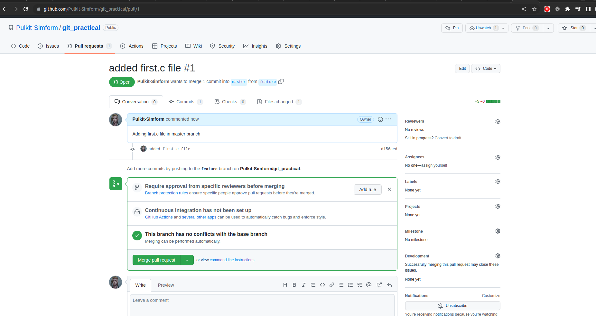
<br/>
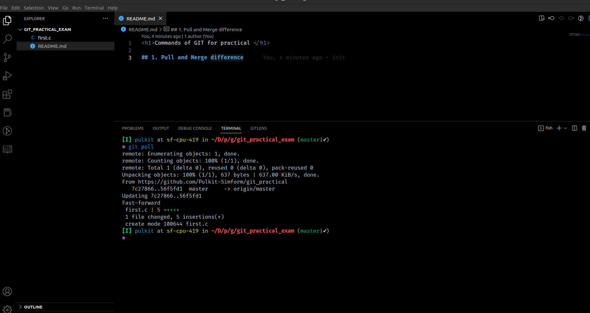


### for merge 
```bash
    git merge <branch-name>
```
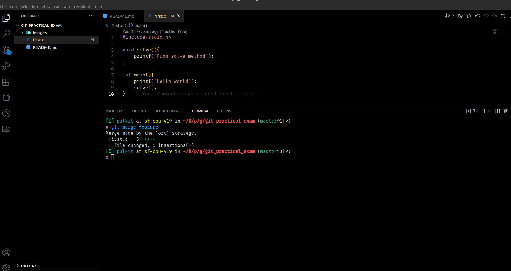

<br />

## 2. Rebase

```bash
    git rebase <branch-name>
```
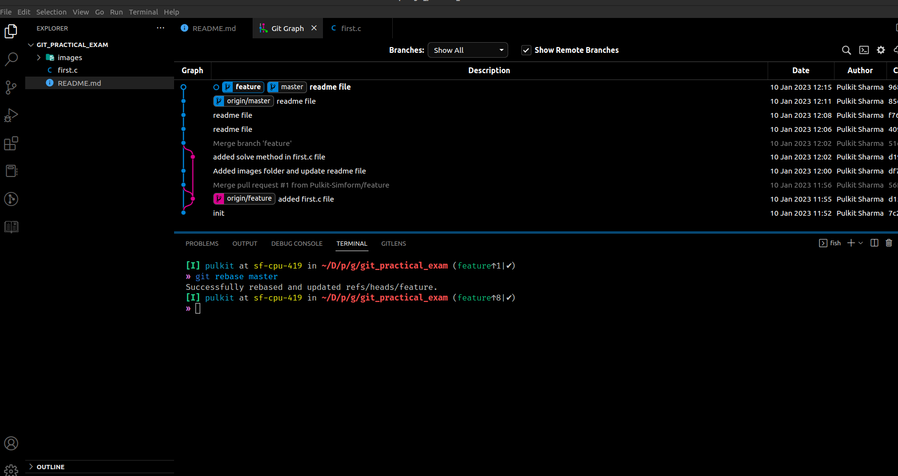


## 3. Change Commit Message

```bash
    git rebase -i @~n    # here n stands for to the n commit that we want to change
    # and inside we have to use reword
    # or if we want to change last then we have to use
    git commit --amend

    # here we have used git commit --amend for rewording last commit
```
<h3>Before renaming check de2da56 </h3>
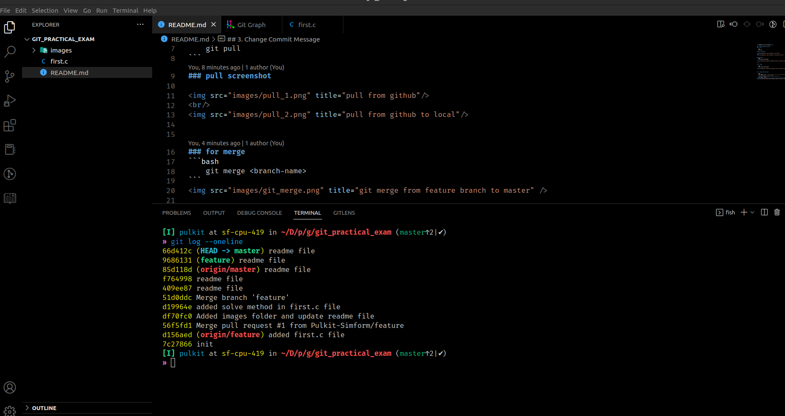

<h3>After renaming check de2da56 </h3>
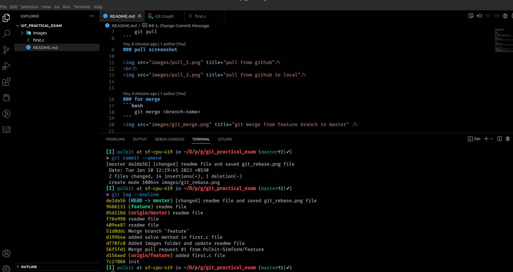

## 4. Cherry Pick


```bash
   git cherry-pick <hash-code-of commit>

   e.g. git cherry-pick df88675
```


<h3>Before cherry-pick  </h3>
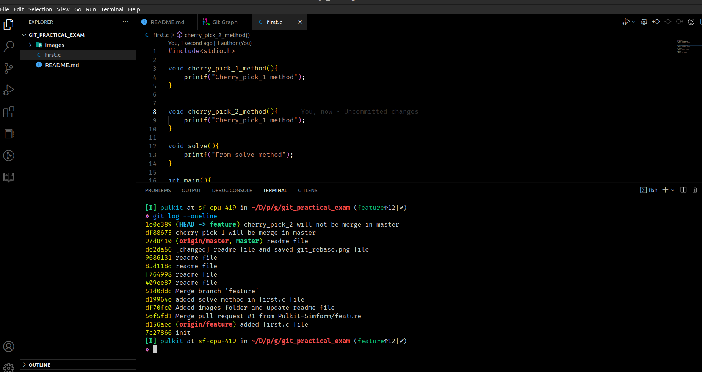

<h3>After cherry-pick  </h3>
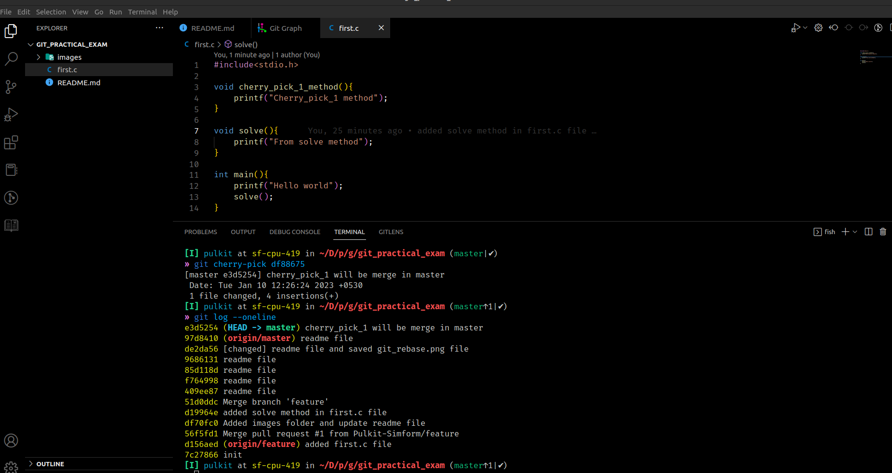


## 5. Drop commit


```bash
   git rebase -i @~n # n from where to pick

   # and then inside choose the commit name
   # after choosing commit name use "drop" for dropping the commit


   !# and for last change simply used
   git reset HEAD^ # and then commit it

```

<h3>Git log  for dropping 98ca8ce</h3>
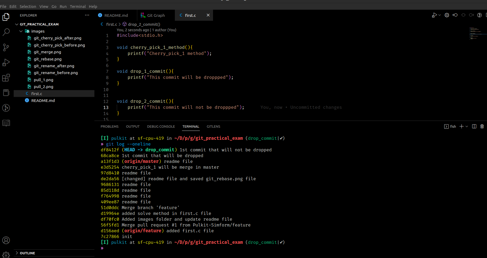

<h3>adding drop inside git rebase</h3>
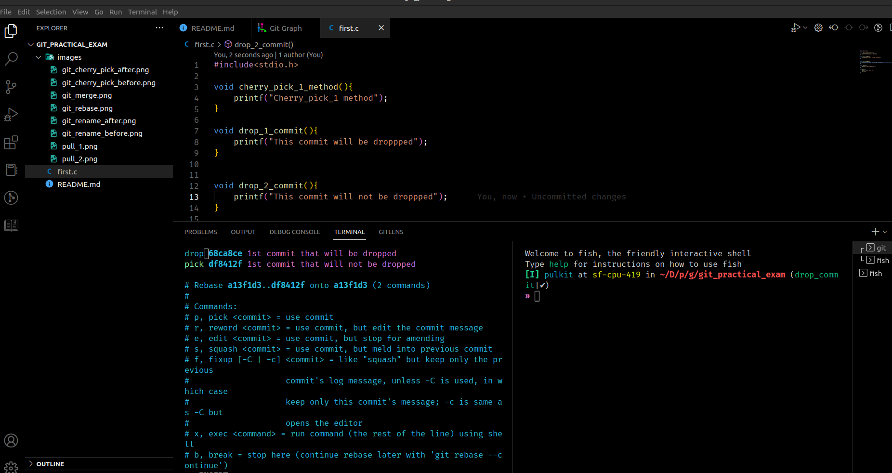

<h3>Successfully dropped commit 98ca8ce</h3>
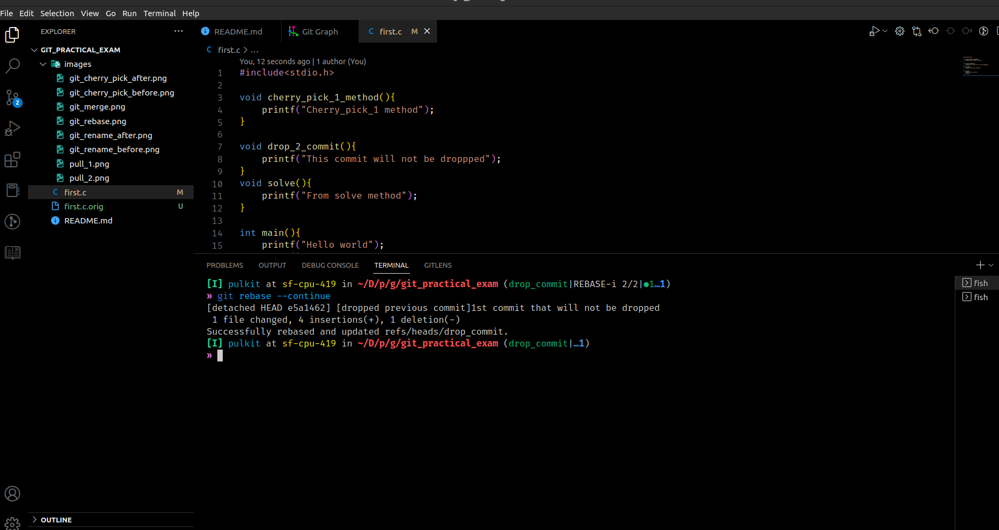

<h3>Git log after dropped</h3>
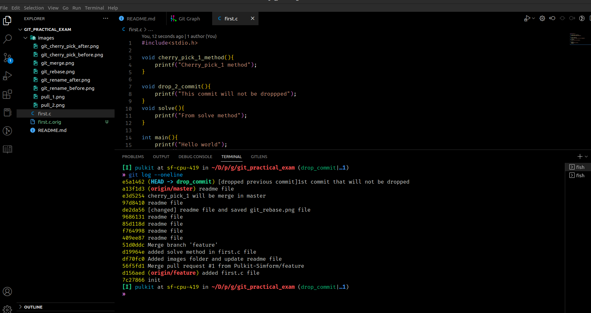


